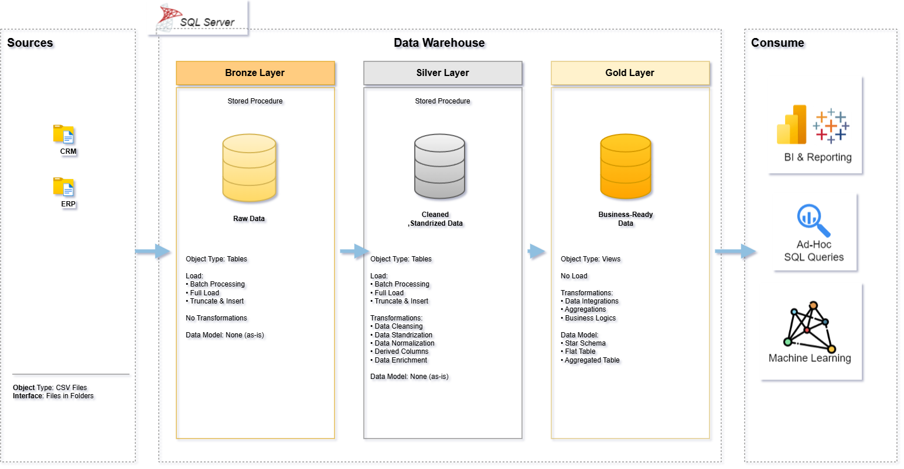

# 📦 SQL Data Warehouse Project

A modern data warehouse built on **SQL Server**, implementing the **Medallion Architecture** (Bronze → Silver → Gold) to transform raw CRM and ERP data into business-ready insights for reporting, analytics, and machine learning.



---

## 🏗️ Architecture Overview

The project follows a three-layer Medallion Architecture:

| Layer | Purpose | Object Type | Load Method | Transformations |
|-------|---------|-------------|-------------|------------------|
| 🥉 **Bronze** | Raw, unprocessed data as-is from source systems | Tables | Full Load (Truncate & Insert) | None |
| 🥈 **Silver** | Cleaned, standardized, analysis-ready data | Tables | Full Load (Truncate & Insert) | Cleansing, Standardization, Normalization, Derived Columns, Enrichment |
| 🥇 **Gold** | Business-ready data modeled for consumption | Views | None | Integration, Aggregation, Business Logic |

**Data flow:** `Sources (CRM, ERP)` → `Bronze` → `Silver` → `Gold` → `BI & Reporting / Ad-Hoc SQL / Machine Learning`

---

## 🗂️ Data Sources

| Source | Format | Interface |
|--------|--------|-----------|
| **CRM** (Customer Relationship Management) | CSV Files | Files in Folders |
| **ERP** (Enterprise Resource Planning) | CSV Files | Files in Folders |

### Source Tables

| System | Table | Description |
|--------|-------|--------------|
| CRM | `crm_sales_details` | Transactional records about sales & orders |
| CRM | `crm_cust_info` | Customer information |
| CRM | `crm_prd_info` | Current & historical product information |
| ERP | `erp_cust_az12` | Extra customer information (birthdate) |
| ERP | `erp_loc_a101` | Customer location (country) |
| ERP | `erp_px_cat_g1v2` | Product categories |

---

## 🥇 Gold Layer Data Model (Star Schema)

The Gold layer exposes a star schema optimized for reporting:

- **`gold.fact_sales`** — order_number, product_key (FK), customer_key (FK), order_date, shipping_date, due_date, sales_amount, quantity, price
- **`gold.dim_customers`** — customer_key (PK), customer_id, customer_number, first_name, last_name, country, marital_status, gender, birthdate
- **`gold.dim_products`** — product_key (PK), product_id, product_number, product_name, category_id, category, subcategory, maintenance, cost, product_line, start_date

**Business rule:** `sales_amount = quantity * price`

---

## ⚙️ Layer Details

### 🥉 Bronze Layer
- **Objective:** Traceability & debugging
- **Target audience:** Data Engineers
- **Workflow:** Interview source systems → Data Ingestion → Data Completeness & Schema Checks → Documentation & Git versioning

### 🥈 Silver Layer
- **Objective:** Prepare data for analysis (intermediate layer)
- **Target audience:** Data Analysts, Data Engineers
- **Workflow:** Explore & Understand the Data → Data Cleansing → Data Correctness Checks → Documentation & Git versioning (data flow, data integration)

### 🥇 Gold Layer
- **Objective:** Provide business-ready data for reporting & analytics
- **Target audience:** Data Analysts, Business Users
- **Data Modeling:** Star Schema, Aggregated Objects, Flat Tables
- **Workflow:** Explore & Understand Business Objects → Data Integration → Data Integration Checks → Documentation & Git versioning (data model, data catalog, data flow)

---

## 🔍 Source System Interview Checklist

Before onboarding a new source, the following areas are assessed:

**Business Context & Ownership**
- Who owns the data?
- What business process does it support?
- System & data documentation
- Data model & data catalog

**Architecture & Technology Stack**
- How is data stored? (SQL Server, Oracle, AWS, Azure, ...)
- What are the integration capabilities? (API, Kafka, File Extract, Direct DB, ...)

**Extract & Load**
- Incremental vs. Full Loads?
- Data scope & historical needs
- Expected size of extracts
- Data volume limitations
- How to avoid impacting source system performance?
- Authentication & authorization (tokens, SSH keys, VPN, IP whitelisting, ...)

---

## 🛠️ Tech Stack

- **Database:** SQL Server
- **ETL:** Stored Procedures
- **Version Control:** Git
- **Consumption:** BI & Reporting tools, Ad-Hoc SQL Queries, Machine Learning

---

## 📁 Repository Structure

```
├── datasets/           # Raw source files (CRM, ERP)
├── Script/
│   ├── bronze/         # Bronze layer stored procedures (ingestion)
│   ├── silver/         # Silver layer stored procedures (cleansing/transformation)
│   └── gold/           # Gold layer views (business logic)
├── docs/                # Architecture diagrams & data catalog
└── README.md
```

---

## 🚀 Getting Started

1. Clone the repository
   ```bash
   git clone <repo-url>
   ```
2. Set up a SQL Server instance and create the `bronze`, `silver`, and `gold` schemas
3. Run the Bronze layer scripts to ingest raw CRM/ERP data
4. Run the Silver layer scripts to clean and standardize the data
5. Run the Gold layer scripts to build the star schema views
6. Connect your BI tool (Power BI, Tableau, etc.) to the Gold layer for reporting

---

## 👤 Author

**Amr** — Data Engineer | Python, SQL Server, ETL Pipelines
